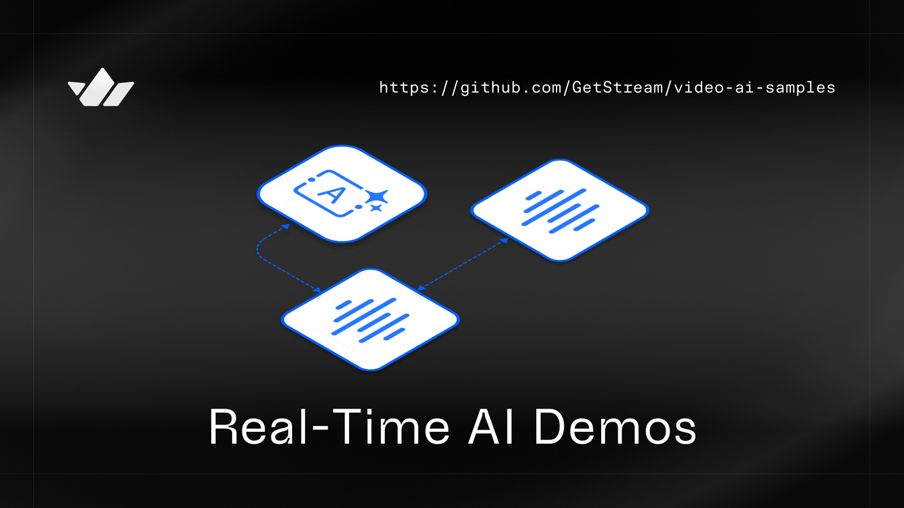

# Real-time Video AI by Stream 🛥



## 😎 Repo Overview
This repo contains different samples across AI, LLMs, and computer vision running in real time on Stream's low-latency [Video API](https://getstream.io/video/). To run these examples, developers can [register for a free account](https://getstream.io/try-for-free/) to obtain an API key and bring their favourite AI service. 


<br/>

## Stream Video
Stream Video is a low-latency WebRTC API running on the [edge](https://getstream.io/blog/announcing-stream-video/). It serves traditional conferencing use cases, low-latency [livestreaming](https://getstream.io/video/livestreaming/) (with HLS and RTMP), and conversational voice/video agents. Developers can build with either Node.js or Python on the backend, while frontend developers can easily integrate with a few lines of code across [Android](https://getstream.io/video/sdk/android/), [iOS](https://getstream.io/video/sdk/ios/), [Flutter](https://getstream.io/video/sdk/flutter/), [React Native](https://getstream.io/video/sdk/react-native/), [React](https://getstream.io/video/sdk/react/), [JavaScript](https://getstream.io/video/sdk/javascript/) and [Unity](https://getstream.io/video/sdk/unity/) using our pre-built UI libraries.

## 🔎 Examples

> 💡 Have a sport you like? We are accepting contributions from the community to creative Video AI examples. Open a PR or ping us on X with your examples, and we’d love to highlight it in our repo ⭐

| **🔮** Official Samples |  |
| --- | --- |
|<br><h3>Mini-golf coaching assistant</h3>[live_sports_coach](https://github.com/GetStream/video-ai-samples/tree/live-sports-coach/live_sports_coach) is a real-time video AI example using Google’s Gemini Live to analyse players posture and putting skills. The example can be run in both a real-time mode using a device camera to view and analyse posture, or it can be run with a pre-recorded example file, which is great for debugging and tweaking the model configuration.  | [](https://youtu.be/_MIrA9ogntY) |
| <br><h3>Kickboxing tutor</h3>[Kickboxing tutor](https://github.com/GetStream/video-ai-samples/tree/live-sports-coach/live_sports_coach/kickboxing_example.py) is a real-time AI tutor which uses [Ultralytics YOLO](https://docs.ultralytics.com/tasks/pose/) model to detect and outline body movement before sending those frames to Gemini Live, where the model can help you improve your Kickboxing technique. | [](https://youtu.be/ZYyRXocKoCk)  | |


## 

<a href="https://getstream.io/?utm_source=Github&utm_medium=Github_Repo_Content_Ad&utm_content=Developer&utm_campaign=Video_AI_Demos&utm_term=DevRelOss">

</a>

## 🛥 Stream for builders 
Stream is free for most side and hobby projects. To qualify, your project/company needs to have < 5 team members and < $10k in monthly revenue. Makers get $100 in monthly credit for video for free. For more details, check out the [Maker Account](https://getstream.io/maker-account/?utm_source=Github&utm_medium=Github_Repo_Content_Ad&utm_content=Developer&utm_campaign=Video_AI_Demos&utm_term=DevRelOss).

## 

## Find this repo useful? 💙

Support it by joining [**stargazers**](https://github.com/getStream/video-ai-samples/stargazers) for this repository. ⭐️

# License

```xml
Copyright 2025 Stream.IO, Inc. All Rights Reserved.
Licensed under the Apache License, Version 2.0 (the "License");
you may not use this file except in compliance with the License.
You may obtain a copy of the License at
   http://www.apache.org/licenses/LICENSE-2.0
Unless required by applicable law or agreed to in writing, software
distributed under the License is distributed on an "AS IS" BASIS,
WITHOUT WARRANTIES OR CONDITIONS OF ANY KIND, either express or implied.
See the License for the specific language governing permissions and
limitations under the License.
```
